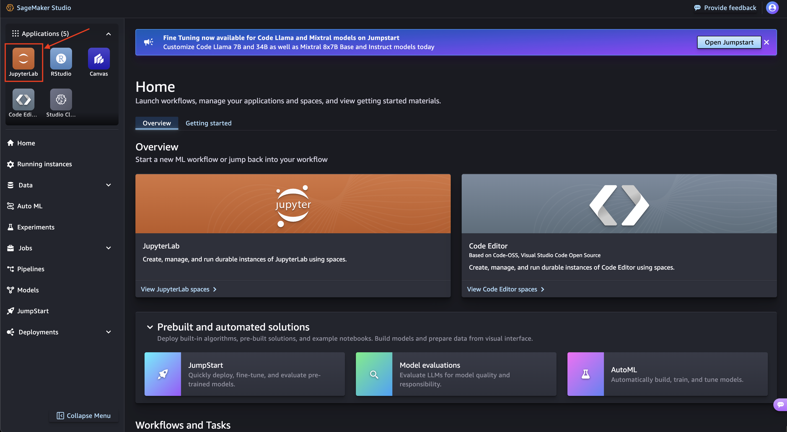

<!---- Provide an overview of what is being achieved in this repo ---->
# ESA NASA Foundation Model Workshop 2025

# Slides:


# Prerequisites
1. Basic understanding of git
2. Python and jupyter environment knowledge
3. Basic understanding of docker
4. Basic understanding of cloud services
5. Machine Learning knowledge
6. Some understanding of Geo-spatial datasets.

# Getting started
1. Navigate to [Login URL](https://workshop-domain-wfs0nk4u.auth.us-west-2.amazoncognito.com/login?client_id=809mbkpbfj5mddgb7dismf3g0&response_type=code&scope=aws.cognito.signin.user.admin+openid+profile&redirect_uri=https://ngsa42o8k5.execute-api.us-west-2.amazonaws.com/invoke)

2. Log in using the credential provided

3. Once the Studio starts, Click on JupyterLab


4. <code style="color : red">A JupyterLab space should already be availble for you. If not, please follow along the next steps}.</code>
5. Click `Create JupyterLab Space`

6. Give it a name. Eg: `Workshop`
7. Once initialized, change Instance type to `ml.p3.2xlarge` and storage to `50`

8. Click on `Run Space`. If it throws an error, you might have to pick an Image. The top setting called `Latest` works.


The following steps are to be followed if the `ESA-NASA-workshop-2025` folder is not available in your jupyterlab environment.

1. Clone this repository `git clone https://github.com/nasa-impact/ESA-NASA-workshop-2025.git`
```
a. Click `git`
b. Click on `Git Clone Repo`

c. Paste `https://github.com/nasa-impact/ESA-NASA-workshop-2025.git` and Click on `Clone`.


```

Notebooks are available for each track which can be ran in the jupyterlab environment.
